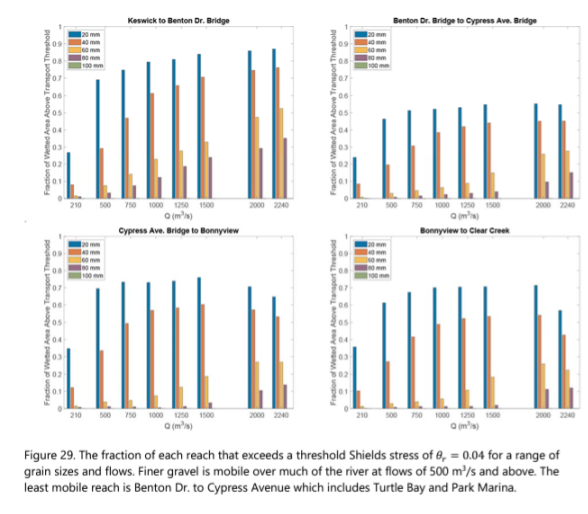

```{r setup, include=FALSE}
knitr::opts_chunk$set(echo = TRUE, 
                      message = FALSE,
                      warning = FALSE)
# knitr::opts_knit$set(root.dir = rprojroot::find_rstudio_root_file())
```

## Data Preperation

This section outlines how data was wrangled for use in this analysis. 
These section are referenced through out this document.

### Gravel Size

Gravel size data was obtained by digitizing the bar plot shown below
from the [link to report](#). 

{fig-alt="Figure of source plot from which we digitized data"}

The digitizing process was done using [Webplot Digitizer](#) and produced data with 
the following structure (only first few rows are shown).

```{r}
library(tidyverse)
library(gt)
library(gridExtra)
library(lubridate)

theme_set(theme_bw())
gravel_size_scaledown <- read_csv("data-raw/spawning-habitat-decay/data/sediment-prop-move.csv")

gt(head(gravel_size_scaledown)) |> 
  cols_label(flow_m3s = "Flow (m3s)", 
             fraction = "Fraction", 
             reach = "Reach")
```

Gravel scaledown is further summarized to a single flow to fraction of movement
curve to represent the entire area of interest. This process is shown below as
well as the output.
 
```{r}
#| echo: true
gravel_size_to_prop_of_movement <- gravel_size_scaledown |> 
  mutate(
    flow_cfs = flow_m3s * 35.315,
    flow_cfday = flow_cfs * 86400) |> 
  group_by(flow_cfs) |> 
  summarise(
    min_fraction = min(fraction), 
    avg_fraction = mean(fraction),
    max_fraction = max(fraction)
  ) 

usethis::use_data(gravel_size_to_prop_of_movement, overwrite = TRUE)

gt(gravel_size_scaledown_summarized)
```


### Flow to transport curves

Flow to sediment transport curves were created using an SRH2D model developed
for the Upper Sacramento River. 


```{r}
#| message: false

files_to_read <- list.files("data/SedimentRatingCurves/",
                            pattern = ".txt",
                            full.names = TRUE)


rating_curves_by_rm <- map_df(files_to_read, function(x) {
  river_mile <- str_match(x, "[0-9]+\\.?[0-9]+")[,1]
  read_tsv(x, skip = 1, col_names = c("flow", "parker_qs", "wilcock_qs", "gaeuman_qs")) |> 
    mutate(river_mile = as.numeric(river_mile))
})

```

The raw data has the following format:

```{r}
gt(rating_curves_by_rm %>% head(5)) |>  
  gt::cols_label(flow = "Flow (cfs)", 
                 parker_qs = "Parker", 
                 wilcock_qs = "Wilcock", 
                 gaeuman_qs = "Gaeuman", 
                 river_mile = "River Mile") |> 
  gt::tab_footnote("355 additional rows not shown")
```


#### Processing transport curves

Transport curves for 4 different __models__ are provided, each of these is defined
for set of flows and at a set of river mile locations. We compute a single curve
from these by first extracting the minimum transport from each of the 4 curves
at corresponding river mile and flow values. After this we summarize again, 
this time across all river miles. We end up with a single curve with shown below.

_Note: our choice choosing the minimum in the first summary above is somewhat arbitraty and can be easily updated_


```{r}
#| cache: true

rating_curve <- rating_curves_by_rm |> 
  rename(flow_cms = flow) |> 
  pivot_longer(parker_qs:gaeuman_qs, names_to = "curve", values_to = "transport_m3_per_second") |> 
  mutate(
    flow_cfs = 35.315 * flow_cms,
    flow_cfd = flow_cfs * 86400, # cubic feet per day
    transport_ft3_per_second = 35.315 * transport_m3_per_second,
    transport_ft3_per_day = 86400 * transport_ft3_per_second # transport per day
  ) |> 
  group_by(flow_cfs, river_mile) |> 
  summarise(
    sed_ft3_per_second_min = min(transport_ft3_per_second), 
    sed_ft3_per_second_avg = mean(transport_ft3_per_second),
    sed_ft3_per_second_max = max(transport_ft3_per_second),    
    sed_ft3_per_day_min = min(transport_ft3_per_day), 
    sed_ft3_per_day_avg = mean(transport_ft3_per_day),
    sed_ft3_per_day_max = max(transport_ft3_per_day)
  ) |> 
  ungroup() |> 
  group_by(flow_cfs) |> 
  summarise(
    sed_ft3_per_second_min = mean(sed_ft3_per_second_min), 
    sed_ft3_per_second_avg = mean(sed_ft3_per_second_avg),
    sed_ft3_per_second_max = mean(sed_ft3_per_second_max),
    sed_ft3_per_day_min = mean(sed_ft3_per_day_min), 
    sed_ft3_per_day_avg = mean(sed_ft3_per_day_avg),
    sed_ft3_per_day_max = mean(sed_ft3_per_day_max),
  ) |>
  ungroup() |> 
  mutate(flow_cfd = flow_cfs * 86400)

rating_curve_for_calib <- rating_curve

srh2d_upper_sac_rating_curves <- rating_curve |> 
  add_row(flow_cfs = 0,
          sed_ft3_per_day_min = 0, 
          sed_ft3_per_day_avg = 0, 
          sed_ft3_per_day_max = 0, 
          sed_ft3_per_second_min = 0, 
          sed_ft3_per_second_avg = 0, 
          sed_ft3_per_second_max = 0
          )


usethis::use_data(srh2d_upper_sac_rating_curves, overwrite = TRUE)
```


This results in the following data:

```{r}
#| echo: false


rating_curve %>% 
  pivot_longer(names_to = "curve", 
               values_to = "sediment_transport", 
               sed_ft3_per_second_min:sed_ft3_per_second_max) %>%
  mutate(
    curve_label = case_when(
      curve == "sed_ft3_per_second_min" ~ "Min (CFS)",
      curve == "sed_ft3_per_second_avg" ~ "Avg (CFS)",
      curve == "sed_ft3_per_second_max" ~ "Max (CFS)",
    ), 
    curve_label = factor(curve_label, 
                         levels = c(
                           "Max (CFS)",
                           "Avg (CFS)",
                           "Min (CFS)"
                         ))) %>% 
  ggplot(aes(flow_cfs, sediment_transport, color = curve_label)) + 
  geom_line(size = 1.5) + 
  geom_point(size = 2.5) + 
  labs(x = "flow (cfs)", y = "Sediment Transport (cfs)", 
       title = "Sediment Transport Capacity Rating Curves", 
       subtitle = "Flow (cfs) to Transport (cfs)",
       color = NULL) + 
  theme_bw() + 
  theme(legend.position="bottom") 


```

### Sediment in Motion Scaledown

The second scale-down we perform is to account for sediment still in motion. 
To do this we carry out an optimization process that assumes full habitat amount on the
first day of 2015. That is 254690.3 square meters. When converted to cubic feet for
use alongside the sediment transport we assume 2 feet of depth and value becomes
5482973 cubic feet. Based on observed data we anticipate this volume of habitat to
have decayed to zero by April 1st of 2017. The objective function and process 
is shown below.

```{r}
#| echo: true

kwk_usgs <- read_rds("data/kwk-flows-1980-2022.rds")

objective_func <- function(threshold) {
  
  # scale down the tranport curves to just the d50mm threshold of movement
  scaled_sed_transport <- rating_curve_for_calib$sed_ft3_per_day_min * 
    gravel_size_scaledown_summarized$avg_fraction
  
  # create an approxfun given a threshold of movement (this value will be searched by the optim function)
  calib_sed_curve <- approxfun(rating_curve_for_calib$flow_cfs, 
                         scaled_sed_transport * 
                           rep(threshold, 
                               length(rating_curve_for_calib$flow_cfs)))
  
  # convert square meters to cubic feet, assume 2ft depth
  starting_volume <- (254690.3 * 10.764) * 2
  
  calib_kwk_sed_transport <- tibble(
    date = kwk_usgs$Date, 
    flow = kwk_usgs$Flow, 
    sediment_transport_f3_day = calib_sed_curve(flow)
  ) |> 
    mutate(sediment_transport_f3_day = ifelse(is.na(sediment_transport_f3_day), 0, sediment_transport_f3_day))
  
  
  calib_kwk_sed_transport_sim <- calib_kwk_sed_transport |> 
    filter(date >= "2015-01-01", date <= "2017-04-01") |> 
    mutate(sediment_transport_f3_day = ifelse(is.na(sediment_transport_f3_day), 0, sediment_transport_f3_day), 
           sediment_transport_f3_day_accum = cumsum(sediment_transport_f3_day),
           current_vol = starting_volume - sediment_transport_f3_day_accum)
  
  last_volume <- calib_kwk_sed_transport_sim |> tail(1) |> pull(current_vol)
  
  # return absolute distance to zero
  return(abs(last_volume - 0))
}


# We want to optimize the function by the threshold value that results
# in the volumne nearest zero.
result <- optimise(objective_func, interval = c(0, 1), maximum = FALSE)
```

The results after the optimization is that we need to scale down the curves 
by `r result$minimum` to match the observed event. 


```{r, eval = FALSE}
flow_cfs_to_sed_cfd_calibrated <- approxfun(
  x = rating_curve$flow_cfs, 
  y = rating_curve$sed_ft3_per_day_min * 
    gravel_size_scaledown_summarized$avg_fraction * 
    rep(result$minimum, 
        length(rating_curve$flow_cfs))
)

calibrated_kwk_sed_transport <- tibble(
  date = kwk_usgs$Date, 
  flow = kwk_usgs$Flow, 
  sediment_transport_f3_day = flow_cfs_to_sed_cfd_calibrated(flow)
) |> 
  mutate(sediment_transport_f3_day = ifelse(is.na(sediment_transport_f3_day), 0, sediment_transport_f3_day))


starting_volume <- (254690.3 * 10.764) * 2

# add 20000 tons 

kwk_sed_transport_sim <- calibrated_kwk_sed_transport |> 
  filter(date >= "2015-01-01", date <= "2017-04-01") |> 
  mutate(sediment_transport_f3_day = ifelse(is.na(sediment_transport_f3_day), 0, sediment_transport_f3_day), 
         sediment_transport_f3_day_accum = cumsum(sediment_transport_f3_day),
         start_vol = starting_volume,
         current_vol = start_vol - sediment_transport_f3_day_accum)

p1 <- kwk_sed_transport_sim |> 
  ggplot() + 
  geom_line(aes(date, current_vol)) + 
  labs(x = "", y = "Spawning Habitat Vol. (cubic feet)") + 
  theme_bw()

p2 <- kwk_usgs |> 
  filter(Date >= "2015-01-01", Date <= "2017-04-01") |> ggplot(aes(Date, Flow)) + geom_line() + 
  theme_bw()

grid.arrange(p2, p1, nrow = 2)
```


